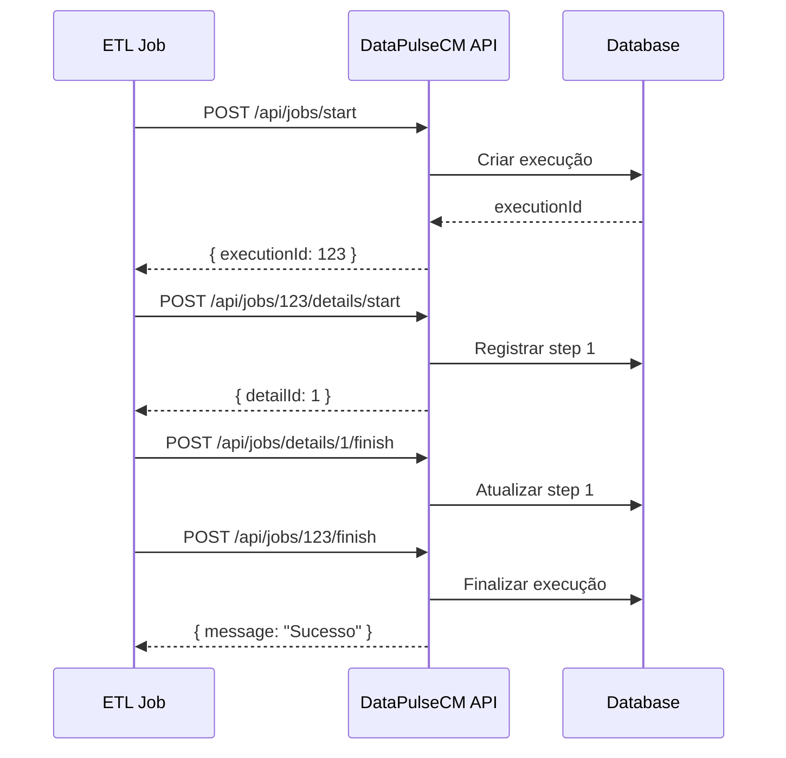

# 🔌 API REST - DataPulseCM

A API REST do DataPulseCM fornece endpoints completos para gerenciamento e consulta de execuções de jobs ETL.

## 📡 Base URL

```
http://localhost:5105/api
https://localhost:7268/api
```

## 🔐 Autenticação

Atualmente, a API não requer autenticação. **Planejado para versões futuras:** JWT Authentication.

## 📚 Documentação Interativa

Acesse a documentação interativa Swagger:

```
https://localhost:7268/swagger
```

## 📊 Endpoints Disponíveis

### Jobs Management

| Método | Endpoint | Descrição |
|--------|----------|-----------|
| `GET` | `/api/jobs` | Lista execuções recentes |
| `GET` | `/api/jobs/{id}` | Busca execução por ID |
| `GET` | `/api/jobs/filter` | Filtra execuções |
| `POST` | `/api/jobs/start` | Inicia nova execução |
| `POST` | `/api/jobs/{id}/finish` | Finaliza execução |

### Statistics & Analytics

| Método | Endpoint | Descrição |
|--------|----------|-----------|
| `GET` | `/api/jobs/statistics` | Estatísticas gerais |
| `GET` | `/api/jobs/failed` | Lista execuções com falha |
| `GET` | `/api/jobs/by-name/{jobName}` | Última execução do job |
| `GET` | `/api/jobs/by-name/{jobName}/history` | Histórico do job |
| `GET` | `/api/jobs/by-name/{jobName}/success-rate` | Taxa de sucesso |

### Execution Details

| Método | Endpoint | Descrição |
|--------|----------|-----------|
| `GET` | `/api/jobs/{id}/details` | Steps da execução |
| `POST` | `/api/jobs/{id}/details/start` | Inicia step |
| `POST` | `/api/jobs/details/{detailId}/finish` | Finaliza step |

### Health

| Método | Endpoint | Descrição |
|--------|----------|-----------|
| `GET` | `/health` | Status da API e database |

## 📦 Formatos de Resposta

Todas as respostas são em **JSON**.

### Sucesso

```json
{
  "data": [...],
  "count": 10
}
```

### Erro

```json
{
  "message": "Descrição do erro",
  "status": 400
}
```

## 🎯 Códigos de Status HTTP

| Código | Significado |
|--------|-------------|
| `200` | Sucesso |
| `201` | Criado |
| `400` | Requisição inválida |
| `404` | Não encontrado |
| `500` | Erro interno do servidor |

## 📝 Modelos de Dados

### JobExecution

```json
{
  "executionID": 123,
  "jobName": "ETL_ImportarVendas",
  "status": "Sucesso",
  "startDate": "2026-02-09T10:30:00",
  "endDate": "2026-02-09T10:35:00",
  "duration": 300,
  "recordsProcessed": 15000,
  "errorMessage": null
}
```

### Statistics

```json
{
  "total": 1500,
  "successful": 1380,
  "failed": 120,
  "successRate": 92.0,
  "byStatus": {
    "Sucesso": 1380,
    "Falha": 120
  }
}
```

### JobExecutionDetail

```json
{
  "detailId": 456,
  "executionId": 123,
  "stepName": "Extrair dados da API",
  "stepOrder": 1,
  "status": "Sucesso",
  "startTime": "2026-02-09T10:30:00",
  "endTime": "2026-02-09T10:31:00",
  "recordsProcessed": 5000,
  "errorMessage": null
}
```

## 🔄 Fluxo Típico de Uso



## 🛡️ Rate Limiting

Atualmente não há limite de requisições. **Planejado para versões futuras.**

## 📊 Paginação

Os endpoints de listagem suportam o parâmetro `limit`:

```http
GET /api/jobs?limit=100
```

**Valores aceitos:** 1-1000 (padrão: 50)

## 🔍 Filtros

Endpoint `/api/jobs/filter` suporta:

```http
GET /api/jobs/filter?jobName=ETL_Vendas&status=Sucesso&startDate=2026-02-01&endDate=2026-02-09
```

**Parâmetros:**
- `jobName` - Nome do job (string)
- `status` - Status da execução (string)
- `startDate` - Data inicial (ISO 8601)
- `endDate` - Data final (ISO 8601)

## 📖 Próximos Tópicos

- [Referência Completa](./reference) - Detalhes de cada endpoint
- [Exemplos](./examples) - Exemplos práticos de uso
- [Integração](./integration) - Como integrar com seus jobs
