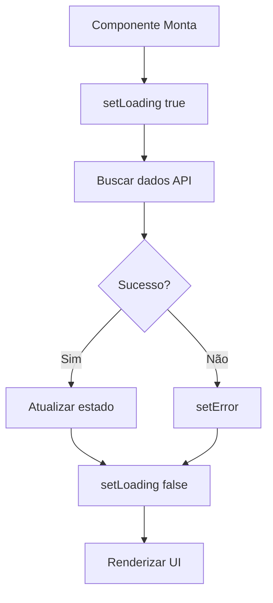

# 🎨 Frontend - Dashboard Web

O DataPulseCM possui um dashboard web moderno construído com React e TypeScript para visualização e análise de execuções de jobs ETL.

## 🎯 Características Principais

### 📊 Dashboard Principal
- **Cards de estatísticas** em tempo real
- **Tabela interativa** com execuções recentes
- **Atualização automática** a cada 30 segundos
- **Design responsivo** para desktop, tablet e mobile

### 🔍 Página de Detalhes
- **Informações completas** da execução
- **Timeline de steps** individuais
- **Mensagens de erro** detalhadas
- **Navegação intuitiva** com breadcrumbs

## 🛠️ Tecnologias Utilizadas

| Tecnologia | Versão | Uso |
|------------|--------|-----|
| React | 19.x | Framework UI |
| TypeScript | 5.x | Type safety |
| Material-UI | 7.x | Componentes visuais |
| React Router | 7.x | Navegação |
| Axios | 1.x | HTTP client |
| date-fns | 4.x | Formatação de datas |
| Vite | 7.x | Build tool |

## 📁 Estrutura do Projeto

```
frontend/
├── src/
│   ├── components/           # Componentes reutilizáveis
│   │   ├── Common/
│   │   │   ├── Loading.tsx
│   │   │   └── StatusBadge.tsx
│   │   └── DashBoard/
│   │       ├── StatisticsCards.tsx
│   │       └── JobsTable.tsx
│   ├── pages/               # Páginas principais
│   │   ├── DashboardPage.tsx
│   │   └── JobDetailsPage.tsx
│   ├── services/            # Serviços de API
│   │   └── api.ts
│   ├── types/               # Tipos TypeScript
│   │   └── job.types.ts
│   ├── App.tsx              # Componente raiz
│   └── main.tsx             # Entry point
├── public/                  # Assets estáticos
├── package.json
├── tsconfig.json
└── vite.config.ts
```

## 🎨 Componentes Principais

### StatisticsCards

Exibe 4 cards com métricas principais:
```tsx
<StatisticsCards statistics={stats} />
```

**Props:**
- `statistics: Statistics` - Dados de estatísticas

### JobsTable

Tabela interativa com execuções:
```tsx
<JobsTable jobs={jobs} />
```

**Props:**
- `jobs: JobExecution[]` - Lista de execuções

**Funcionalidades:**
- Clique em linha para ver detalhes
- Badges de status coloridos
- Formatação de datas e durações

### StatusBadge

Badge colorido para status:
```tsx
<StatusBadge status="Sucesso" />
```

**Props:**
- `status: string` - Status da execução

**Variações:**
- 🟢 Sucesso - Verde
- 🔴 Falha - Vermelho
- 🟡 Em Execução - Amarelo

### Loading

Componente de carregamento:
```tsx
<Loading />
```

## 🔄 Gerenciamento de Estado

O projeto usa **React Hooks** para gerenciamento de estado:

```typescript
const [loading, setLoading] = useState(true);
const [jobs, setJobs] = useState<JobExecution[]>([]);
const [error, setError] = useState<string | null>(null);
```

### LoadingFlow



## 🔌 Integração com API

O arquivo `services/api.ts` centraliza todas as chamadas:

```typescript
import axios from 'axios';

const api = axios.create({
  baseURL: 'http://localhost:5105/api',
});

export const jobsApi = {
  getRecentJobs: async (limit = 50) => {
    const { data } = await api.get(`/jobs?limit=${limit}`);
    return data;
  },
  
  getStatistics: async () => {
    const { data } = await api.get('/jobs/statistics');
    return data;
  },
  
  // ... outros métodos
};
```

## 🎯 Páginas

### DashboardPage

**URL:** `/`

**Funcionalidades:**
- Exibe estatísticas gerais
- Lista execuções recentes
- Atualização automática
- Navegação para detalhes

**Estado:**
```typescript
{
  statistics: Statistics | null;
  jobs: JobExecution[];
  loading: boolean;
  error: string | null;
}
```

### JobDetailsPage

**URL:** `/job/:id`

**Funcionalidades:**
- Informações completas da execução
- Lista de steps detalhados
- Botão voltar ao dashboard
- Mensagens de erro formatadas

**Estado:**
```typescript
{
  job: JobExecution | null;
  details: JobExecutionDetail[];
  loading: boolean;
  error: string | null;
}
```

## 🎨 Temas e Estilos

### Material-UI Theme

```typescript
const theme = createTheme({
  palette: {
    primary: {
      main: '#1976d2',
    },
    secondary: {
      main: '#dc004e',
    },
  },
});
```

### Cores de Status

```typescript
{
  Sucesso: '#2e7d32',    // Verde
  Falha: '#d32f2f',      // Vermelho
  'Em Execução': '#ed6c02' // Laranja
}
```

## 📱 Responsividade

O dashboard é totalmente responsivo:

| Breakpoint | Comportamento |
|-----------|---------------|
| **xs** (< 600px) | Cards em coluna única |
| **sm** (600-960px) | 2 cards por linha |
| **md** (960-1280px) | 4 cards por linha |
| **lg** (> 1280px) | Layout otimizado |

## 🔄 Atualização Automática

O dashboard se atualiza automaticamente:

```typescript
useEffect(() => {
  loadDashboardData();
  
  // Atualizar a cada 30 segundos
  const interval = setInterval(loadDashboardData, 30000);
  
  return () => clearInterval(interval);
}, []);
```

## ⚡ Performance

### Otimizações Implementadas

- **Lazy loading** de páginas com React.lazy
- **Memoização** de componentes pesados
- **Debounce** em filtros e buscas
- **Paginação** eficiente

## 🧪 Desenvolvimento Local

```bash
# Instalar dependências
npm install

# Iniciar dev server
npm run dev

# Build para produção
npm run build

# Preview da build
npm run preview
```

## 🚀 Build para Produção

```bash
npm run build
```

Arquivos gerados em `dist/`:
- HTML, CSS, JS otimizados
- Assets com hash para cache
- Source maps para debug

### Configurar URL da API em Produção

Edite `src/services/api.ts`:

```typescript
const API_BASE = import.meta.env.VITE_API_URL || 'https://api.datapulsecm.com/api';
```

Crie `.env.production`:

```env
VITE_API_URL=https://api.datapulsecm.com/api
```

## 📊 Métricas e Analytics (Futuro)

Planejado:
- Google Analytics integration
- Performance monitoring
- Error tracking (Sentry)
- User behavior analytics

## 🎯 Próximas Funcionalidades

- [ ] Filtros avançados
- [ ] Gráficos de performance
- [ ] Tema dark/light
- [ ] Exportar dados (CSV/PDF)
- [ ] Real-time com SignalR
- [ ] Notificações push

## 📚 Próximos Passos

- [Componentes Detalhados](./components)
- [Criando Novos Componentes](./creating-components)
- [Customização](./customization)
